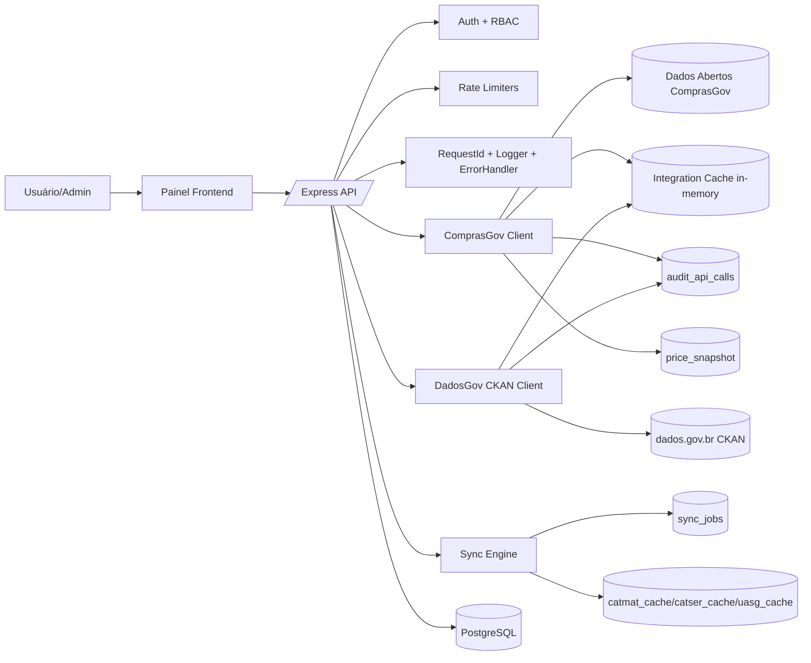

# RELATÓRIO DE AUDITORIA MASTER

## SINGEM — Conformidade, Segurança, Performance e Escalabilidade

## Metadados

- Data de referência: 2026-03-02
- Tipo: Consolidação executiva de auditoria técnica documental
- Escopo: conformidade, segurança, performance e escalabilidade das integrações institucionais
- Implementações: não realizadas neste relatório

## 1) Sumário executivo

Esta Auditoria Master consolida a avaliação técnica das integrações com ComprasGov/DadosGov e dos controles operacionais associados.

### Resultado geral

- **Conformidade:** parcial (boa aderência técnica, lacunas de governança documental/retentiva).
- **Segurança:** moderada para API, **crítica** para gestão de segredos e higiene de dependências.
- **Performance:** boa para carga atual, com riscos de degradação em aumento de volume.
- **Escalabilidade:** base funcional, porém sem mecanismos completos para crescimento institucional contínuo.

## 2) Maturidade por domínio (0–5)

| Domínio         |    Nota | Interpretação                                                   |
| --------------- | ------: | --------------------------------------------------------------- |
| Conformidade    |     3.2 | controles técnicos presentes, formalização incompleta           |
| Segurança       |     2.8 | API protegida, mas segredos/dependências elevam risco           |
| Performance     |     3.3 | resiliência boa, faltam práticas de capacidade avançadas        |
| Escalabilidade  |     2.7 | modularidade e lock presentes; faltam dados/processing strategy |
| **Média Geral** | **3.0** | maturidade intermediária                                        |

## 3) Mapa de arquitetura (texto)

## 4) Top 10 riscos (priorizados)

|   # | Risco                                                              | Severidade | Probabilidade | Nível   |
| --: | ------------------------------------------------------------------ | ---------- | ------------- | ------- |
|   1 | Segredos e credenciais sensíveis em arquivos de ambiente           | Crítico    | Alta          | Crítico |
|   2 | Dependências de produção com advisories high (`npm audit`)         | Alto       | Alta          | Alto    |
|   3 | Ausência de `.env.example` seguro para padronização de implantação | Alto       | Média         | Alto    |
|   4 | Sem política de retenção/expurgo para auditoria e snapshot         | Alto       | Média         | Alto    |
|   5 | Crescimento de tabelas históricas sem estratégia de arquivamento   | Alto       | Média         | Alto    |
|   6 | Sync com persistência sequencial sem batching                      | Médio      | Alta          | Alto    |
|   7 | Cache apenas em memória de processo                                | Médio      | Média         | Médio   |
|   8 | Sem suíte formal de carga/capacidade contínua                      | Médio      | Média         | Médio   |
|   9 | Ausência de SLO/SLA técnicos formalizados                          | Médio      | Média         | Médio   |
|  10 | Conformidade LGPD operacional não formalizada nas integrações      | Médio      | Média         | Médio   |

## 5) Top 10 ações recomendadas

|   # | Ação                                                          | Prioridade | Resultado esperado                         |
| --: | ------------------------------------------------------------- | ---------- | ------------------------------------------ |
|   1 | Rotacionar imediatamente segredos (JWT/DB/admin)              | P0         | redução de risco de comprometimento        |
|   2 | Remover defaults inseguros e padronizar baseline de ambiente  | P0         | implantação segura e repetível             |
|   3 | Atualizar cadeia de dependências vulneráveis (incl. `bcrypt`) | P1         | redução de exposição a CVEs                |
|   4 | Implantar política de retenção/expurgo por tabela             | P1         | controle de crescimento e conformidade     |
|   5 | Criar rotina de varredura de dependências em CI               | P1         | prevenção de regressão de segurança        |
|   6 | Implementar batch upsert no sync                              | P1         | ganho de throughput e menor latência total |
|   7 | Instrumentar p95/p99, timeout-rate e erro por endpoint        | P1         | observabilidade para capacity planning     |
|   8 | Definir SLO/SLA institucionais de integração                  | P2         | governança de operação                     |
|   9 | Planejar cache compartilhado para cenário multi-instância     | P2         | estabilidade de performance horizontal     |
|  10 | Formalizar checklist LGPD de integrações                      | P2         | melhor conformidade institucional          |

## 6) Checklist de prontidão (SIM/NÃO)

- SIM — Rotas administrativas de integração exigem autenticação e perfil admin.
- SIM — Há rate limiting global e específico de integrações.
- SIM — Há trilha técnica de auditoria de chamadas externas.
- SIM — Há lock distribuído para evitar concorrência de sync.
- SIM — Há timeout, retry e limites de paginação em integrações.
- NÃO — Não há baseline `.env.example` identificado.
- NÃO — Não há política formal de retenção/expurgo encontrada.
- NÃO — Não há benchmark/capacity test institucional recorrente evidenciado.
- NÃO — Não há SLO/SLA formal para integrações evidenciado.
- NÃO — Não há formalização LGPD operacional específica das integrações evidenciada.

## 7) Plano faseado de remediação

### Fase 1 (0–15 dias) — Contenção de risco

- Rotação de segredos e remoção de defaults inseguros.
- Correção de vulnerabilidades high das dependências de produção.
- Publicação de baseline seguro de configuração de ambiente.

### Fase 2 (15–45 dias) — Robustez operacional

- Política de retenção/expurgo para `audit_api_calls` e `price_snapshot`.
- Métricas de latência p95/p99 e timeout-rate por endpoint.
- Batching de persistência para sync de catálogos.

### Fase 3 (45–90 dias) — Escala institucional

- Estrutura de cache compartilhado para múltiplas instâncias.
- Estratégia de crescimento de dados históricos (arquivamento/particionamento).
- SLO/SLA + rotina periódica de teste de carga e conformidade.

## 8) Limitações da auditoria

- Validação automática contra especificação OpenAPI oficial não foi concluída por indisponibilidade de extração de conteúdo nas consultas externas realizadas durante esta auditoria.
- Não foram encontrados artefatos formais de política LGPD operacional no escopo técnico analisado.

## 9) Arquivos auditados

### Backend e integrações

- `server/app.js`
- `server/config/index.js`
- `server/middleware/auth.js`
- `server/middleware/rateLimit.js`
- `server/middlewares/requestId.js`
- `server/middlewares/requestLogger.js`
- `server/src/middlewares/errorHandler.js`
- `server/integrations/comprasgov/client.js`
- `server/integrations/dadosgov/ckanClient.js`
- `server/integrations/core/integrationCache.js`
- `server/integrations/core/auditApiCalls.js`
- `server/integrations/sync/engine.js`
- `server/routes/integracoes-admin.routes.js`
- `server/routes/integrations.routes.js`
- `server/migrations/005_fase2_integracoes.sql`
- `server/tests/integracoes.contract.test.js`
- `server/.env.development`
- `server/.env.production`

### Frontend (painel e consultas)

- `js/settings/integracoes.js`
- `js/consultas/apiCompras.js`
- `js/consultas/uiConsultas.js`
- `js/consultas/cache.js`

### Documentação/boas práticas

- `docs/INFRAESTRUTURA_ENTERPRISE.md`
- `docs/BOAS_PRATICAS.md`
- `README.md`

## 10) Referências desta auditoria

- `docs/RELATORIO-AUDITORIA-CONFORMIDADE.md`
- `docs/RELATORIO-AUDITORIA-SEGURANCA.md`
- `docs/RELATORIO-AUDITORIA-PERFORMANCE.md`
- `docs/RELATORIO-AUDITORIA-ESCALABILIDADE.md`

## 11) Parecer final

**Parecer técnico:** ambiente com controles importantes já ativos, porém com **itens críticos de segurança e governança operacional** que exigem tratamento prioritário para elevar a prontidão institucional.
